

	<b>BAHASA PEMROGRAMAN</b>

	PERTEMUAN 10 MODULAR / FUNGSI

	Dosen Pengampu : Agung Nugroho, M.Kom

 
	<b>Tugas untuk memenuhi syarat penilain pada Pertemuan Ke - 10</b>

	

                 Nama : Jose Fisto

                 NIM : 312010119

                 Kelas : TI.20 A.1

	

	<b>UNIVERSITAS PELITA BANGSA</b>

	<b>FAKULTAS TEKNIK</b>

	<b>TEKNIK INFORMATIKA</b>

	<b>TA 2020 / 2021</b>

# Tugas Praktikum Pada Lab ke 6

Berikut ini adalah soal pada pertemuan ke 10 pada Lab 6

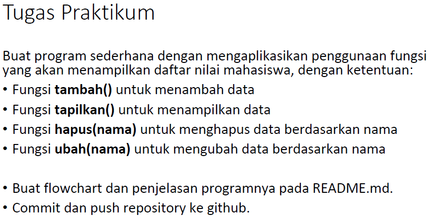

                 Tugas 1.1

Berikut ini adalah syntax yang sesuai dengan soal di atas

(***Syntax Di bawah ini merupakan file python dengan nama lab6 dari nama file direktori syntax***)

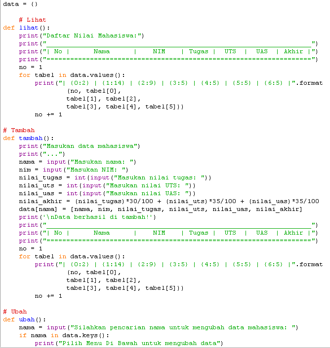

                 Syntax Lab6 2.1

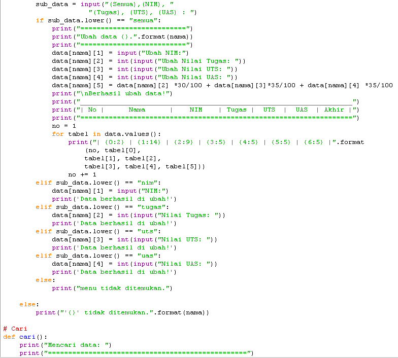

                 Syntax Lab6 2.2

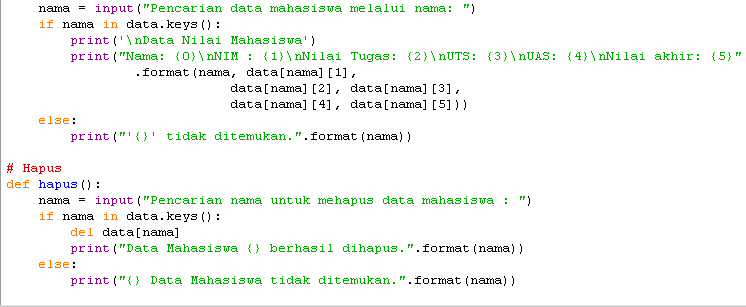

                 Syntax Lab6 2.3

(***Syntax Di bawah ini merupakan file python dengan nama open untuk memanggil fungsi dari folder syntax***)

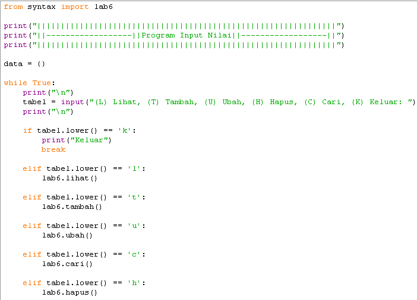

                 Syntax Open (File Open.py sebagai pemanggil fungsi pada file Lab6.py) 3.1

Berikut ini adalah syntax pada file Lab6 dari gambar 2.1 hingga 2.3 di tempatkan pada library "syntax"
---
	data = {}

   	 # Lihat
	def lihat():
    	print("Daftar Nilai Mahasiswa:")
    	print("___________________________________________________________________")
    	print("| No |      Nama      |    NIM    | Tugas |  UTS  |  UAS  | Akhir |")
    	print("===================================================================")
    	no = 1
    	for tabel in data.values():
        	print("| {0:2} | {1:14} | {2:9} | {3:5} | {4:5} | {5:5} | {6:5} |".format
                	(no, tabel[0],
                	tabel[1], tabel[2],
                	tabel[3], tabel[4], tabel[5]))
        	no += 1

	# Tambah
	def tambah():
    	print("Masukan data mahasiswa")
    	print("...")
    	nama = input("Masukan nama: ")
    	nim = input("Masukan NIM: ")
    	nilai_tugas = int(input("Masukan nilai tugas: "))
    	nilai_uts = int(input("Masukan nilai UTS: "))
    	nilai_uas = int(input("Masukan nilai UAS: "))
    	nilai_akhir = (nilai_tugas)*30/100 + (nilai_uts)*35/100 + (nilai_uas)*35/100 
    	data[nama] = [nama, nim, nilai_tugas, nilai_uts, nilai_uas, nilai_akhir]
    	print('\nData berhasil di tambah!')
    	print("___________________________________________________________________")
    	print("| No |      Nama      |    NIM    | Tugas |  UTS  |  UAS  | Akhir |")
    	print("===================================================================")
    	no = 1
    	for tabel in data.values():
        	print("| {0:2} | {1:14} | {2:9} | {3:5} | {4:5} | {5:5} | {6:5} |".format
                	(no, tabel[0],
                	tabel[1], tabel[2],
                	tabel[3], tabel[4], tabel[5]))
        	no += 1

	# Ubah
	def ubah():
    	nama = input("Silahkan pencarian nama untuk mengubah data mahasiswa: ")
    	if nama in data.keys():
        	print("Pilih Menu Di Bawah untuk mengubah data")
        	sub_data = input("(Semua),(NIM), "
                     	"(Tugas), (UTS), (UAS) : ")
        	if sub_data.lower() == "semua":
            	print("==========================")
            	print("Ubah data {}.".format(nama))
            	print("==========================")
            	data[nama][1] = input("Ubah NIM:")
            	data[nama][2] = int(input("Ubah Nilai Tugas: "))
            	data[nama][3] = int(input("Ubah Nilai UTS: "))
            	data[nama][4] = int(input("Ubah Nilai UAS: "))
            	data[nama][5] = data[nama][2] *30/100 + data[nama][3]*35/100 + data[nama][4] *35/100 
            	print("\nBerhasil ubah data!")
            	print("___________________________________________________________________")
            	print("| No |      Nama      |    NIM    | Tugas |  UTS  |  UAS  | Akhir |")
            	print("===================================================================")
            	no = 1
            	for tabel in data.values():
                	print("| {0:2} | {1:14} | {2:9} | {3:5} | {4:5} | {5:5} | {6:5} |".format
                    	(no, tabel[0],
                    	tabel[1], tabel[2],
                    	tabel[3], tabel[4], tabel[5]))
                	no += 1
        	elif sub_data.lower() == "nim":
            	data[nama][1] = input("NIM:")
            	print('Data berhasil di ubah!')
        	elif sub_data.lower() == "tugas":
            	data[nama][2] = int(input("Nilai Tugas: "))
            	print('Data berhasil di ubah!')
        	elif sub_data.lower() == "uts":
            	data[nama][3] = int(input("Nilai UTS: "))
            	print('Data berhasil di ubah!')
        	elif sub_data.lower() == "uas":
            	data[nama][4] = int(input("Nilai UAS: "))
            	print('Data berhasil di ubah!')
        	else:
            	print("menu tidak ditemukan.")

    	else:
        	print("'{}' tidak ditemukan.".format(nama))

	# Cari
	def cari():
    	print("Mencari data: ")
    	print("=================================================")
    	nama = input("Pencarian data mahasiswa melalui nama: ")
    	if nama in data.keys():
        	print('\nData Nilai Mahasiswa')
        	print("Nama: {0}\nNIM : {1}\nNilai Tugas: {2}\nUTS: {3}\nUAS: {4}\nNilai akhir: {5}"
                	.format(nama, data[nama][1],
                            	data[nama][2], data[nama][3],
                            	data[nama][4], data[nama][5]))
    	else:
        	print("'{}' tidak ditemukan.".format(nama))

	# Hapus
	def hapus():
    	nama = input("Pencarian nama untuk mehapus data mahasiswa : ")
    	if nama in data.keys():
        	del data[nama]
        	print("Data Mahasiswa {} berhasil dihapus.".format(nama))
    	else:
        	print("{} Data Mahasiswa tidak ditemukan.".format(nama))
---

Syntax di atas yang sesuai dengan syntax pada gambar "Syntax Lab6 2.1 - 2.3" merupakan fungsi untuk pemanggilan nama. Di setiap statements yang di isi yang ada di atas file kodingan tersebut untuk membuat fungsi def dimana file tersebut di pisahkan dengan file koding pemanggilan untuk memanggil fungsi.

Berikut ini adalah syntax pada file Open dari gambar 3.1 di tempatkan pada folder library "Tugas Pertemuan ke 10"
---
	from syntax import lab6

	print("|||||||||||||||||||||||||||||||||||||||||||||||||||||||||||||||")
	print("||------------------||Program Input Nilai||------------------||")
	print("|||||||||||||||||||||||||||||||||||||||||||||||||||||||||||||||")

	data = {}

	while True:
    	print("\n")
    	tabel = input("(L) Lihat, (T) Tambah, (U) Ubah, (H) Hapus, (C) Cari, (K) Keluar: ")
    	print("\n")

    	if tabel.lower() == 'k':
       	 print("Keluar")
        	break

    	elif tabel.lower() == 'l':
       		lab6.lihat()

    	elif tabel.lower() == 't':
        	lab6.tambah()
        
    	elif tabel.lower() == 'u':
        	lab6.ubah()

    	elif tabel.lower() == 'c':
        	lab6.cari()

    	elif tabel.lower() == 'h':
        	lab6.hapus()
---
Syntax di atas berfungsi atau untuk memanggil dan menjalankan syntax yang telah di buat fungsinya yaitu def untuk bagaimana cara memanggil fungsi tinggal isi . untuk melihat bagaimana cara proses berjalan syntax tersebut dapat di lihat pada syntax baris pertama yaitu

`from syntax import lab6`

fungsi dari syntax tersebut untuk memanggil fungsi pada sub menu yaitu `def` syntax yang telah dibuat pada file lab6.py yang terletak di folder library `syntax`

## Berikut ini adalah tata cara bagaimana fungsi sehingga dapat dijalankan :

1. Buat 1 folder library dengan nama `Fungsi` sehingga letak folder dapat diketahui

                 Tata cara Fungsi 4.1

2. Buat 1 folder lagi di dalam folder library yang telah dibuat tadi dengan nama `syntax` untuk membuat fungsi pada file python untuk membuat fungsi.

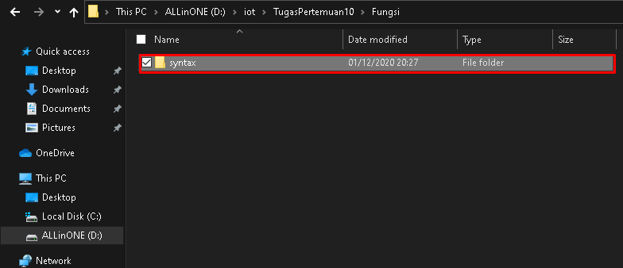

                 Tata cara Fungsi 4.2

3. Selanjutnya buat file python dengan nama `lab6` dan letakkan di dalam folder library `syntax` lalu isi syntax untuk membuat fungsi (disini syntax yang digunakan untuk mengisi Data Mahasiswa)

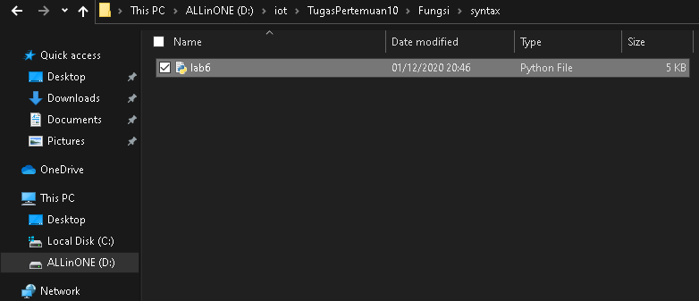

                 Tata cara Fungsi 4.3

4. Jika sudah buat file python pada library `syntax`, selanjutnya buat file python dengan nama `open` pada library `Fungsi` digunakan untuk memanggil fungsi pada file `lab6` yang terletak di library `syntax`

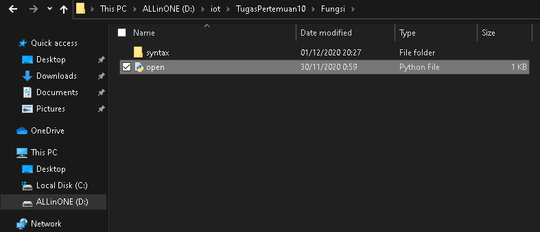

                 Tata cara Fungsi 4.4

5. Jika semua sudah, maka mari coba menjalankan file python `open`

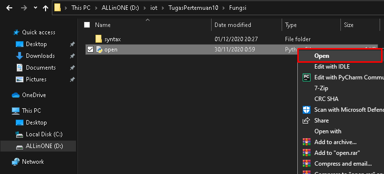

                 Tata cara Fungsi 4.5

6. Dan alhasil, fungsi dapat berjalan dengan lancar.

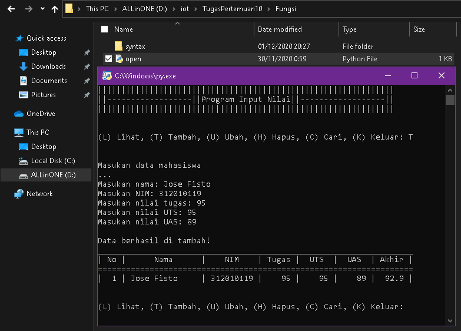

                 Tata cara Fungsi 4.6

`Kegunaan dari modular / fungsi membantu para programming untuk memisahkan file - file yang berekstensi yang berisi syntax jika sewaktu - waktu program dijalankan terjadinya masalah dapat di perbaiki satu persatu dan memudahkan untuk perawatan (maintenance) program.`

## Berikut ini adalah flowchart dari modular / fungsi

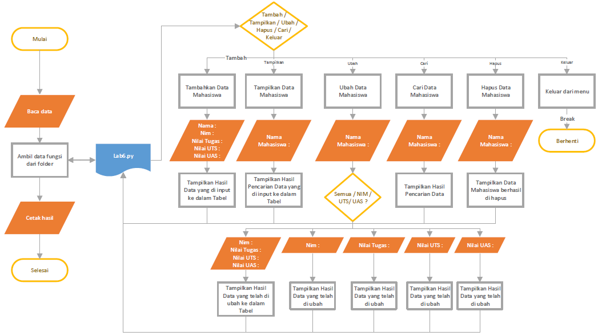

                 Flowchart 5.1

# **Sekian dari saya Terima Kasih.**